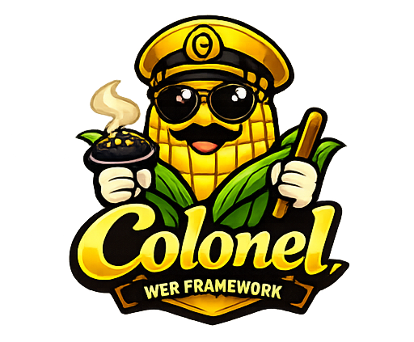

[](LICENSE)
[](https://bun.sh)
[](https://www.typescriptlang.org)
[](packages/framework/src/Http/Kernel.container.test.ts)

## About Colonel

Colonel is a TypeScript-first web framework running on Bun, with a minimal HTTP kernel, router, dependency injection container, and EJS view support.

## Why Teams Choose Colonel

From a user's perspective, Colonel is designed to avoid common framework pain points:

- "I cannot tell where behavior comes from" -> Colonel favors explicit wiring and predictable flow.
- "Upgrades break too much at once" -> Colonel treats the 1.x API contract as stable.
- "Dependency injection feels like magic" -> Colonel keeps constructor injection explicit and debuggable.
- "Framework defaults are heavy" -> Colonel keeps a compact core and additive features.
- "Generated projects drift from docs" -> Colonel validates template parity and scaffold smoke tests.

Read the full user-focused breakdown in [docs/why-colonel.md](docs/why-colonel.md).

## Monorepo Layout

- [packages/framework](packages/framework) core runtime package published as `@coloneldev/framework`
- [packages/create-colonel](packages/create-colonel) project scaffolder published as `create-colonel`
- [examples/web](examples/web) reference application and integration example
- [docs](docs) GitHub Pages-ready documentation site

## Local Development

Install dependencies:

```bash
bun install
```

Run the example web app:

```bash
bun run start
```

Open http://localhost:5000.


## Tests

Current automated tests live in the framework package.

Run all configured tests from the repo root:

```bash
bun run test
```

Run framework tests directly:

```bash
bun run test:framework
```

## Scaffolding A New App

```bash
bunx create-colonel my-app
cd my-app
bun run start
```

During local development in this monorepo:

```bash
bun packages/create-colonel/src/cli.ts my-app
cd my-app
bun run start
```

## Upgrade An Existing App

Inside a generated Colonel app, upgrade to the latest published framework with:

```bash
bun run upgrade:colonel
```

## Release Status

Colonel now targets the stable `1.x` release line.

- Stable API contract: [docs/stable-api.md](docs/stable-api.md)
- 1.0 release notes: [docs/release-notes-1.0.md](docs/release-notes-1.0.md)
- Support policy: [docs/support-policy.md](docs/support-policy.md)
- Developer experience progress: [docs/developer-experience-progress.md](docs/developer-experience-progress.md)
- Security policy: [SECURITY.md](SECURITY.md)

## License

MIT. See [LICENSE](LICENSE).
